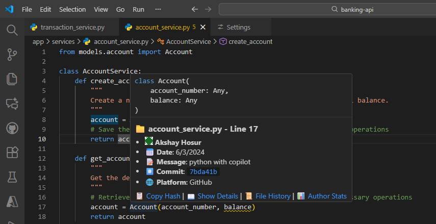
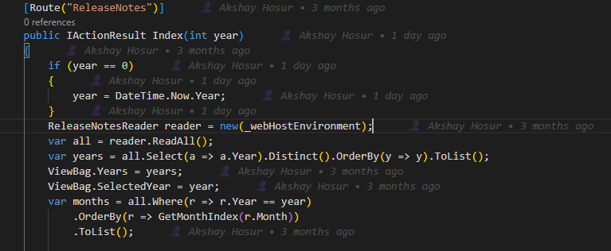
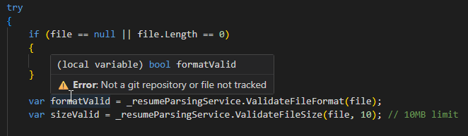

# Git Blame Hover

**Git blame, exactly when you want it - nowhere else.**

Hover over any line of code and instantly see who changed it, when, and why.
No gutters. No sidebars. No noise.

## ✨ **Why Git Blame Hover?**

Most Git extensions try to turn VS Code into a Git dashboard. Git Blame Hover does one thing — and does it quietly.

  - Shows blame only on hover <br>
  - Zero visual clutter <br>
  - Lightweight & fast <br>
  - Works with GitHub, GitLab, Azure Repos, Bitbucket <br>
  - Ideal for large repos & enterprise codebases <br>

## 🖱️ **How it works**
Just hover your mouse over a line of code.

You’ll see:
  - Author name
  - Commit date
  - Commit message (the “why”)
  - Commit hash

Move away → it disappears.

That’s it.

## 🧠 **When should you use Git Blame Hover?**

Use this extension if you:
  - Only want Git blame when you ask for it
  - Don’t want gutter annotations or overlays
  - Prefer minimal tooling during code reviews
  - Already disabled most GitLens features
  - Work in large or performance-sensitive repositories

## **🚀 Performance-first by design**
  - No background Git scans
  - Blame runs only on hover
  - Cached per file & commit
  - No telemetry
  - No network calls
  - Works fully offline

Built to be safe for monorepos and enterprise environments.

## **🔐 Enterprise-friendly**
  - No data collection
  - No external services
  - Uses local Git only
  - Predictable behavior
Safe for locked-down environments.


> 🚀 **Advanced git blame with hover tooltips, inline annotations, heat maps, and comprehensive analytics - instant blame information with zero configuration**

## 🎯 **What Makes This Different?**

Unlike other git blame extensions that clutter your status bar or add inline annotations, **Git Blame Hover** provides blame information exactly when and where you need it - **on hover**.

| **Git Blame Hover** ✨ | **Other Extensions** 😑 |
|------------------------|-------------------------|
| 🎯 **Hover-based** - Info appears only when needed | 📊 Status bar clutter - Always visible |
| 🚫 **Zero UI clutter** - No persistent visual elements | 📝 Inline annotations - Text everywhere |
| ⚡ **Performance optimized** - Smart caching & debouncing | 🐌 Continuous processing - CPU intensive |
| 🎨 **Smart tooltips** - Rich formatting with emojis | 📋 Plain text - Basic information |
| ⚙️ **Fully configurable** - Show exactly what you want | 🔒 Fixed format - Limited customization |


## ✨ **Key Features**

### 🎯 **Advanced Hover Tooltips**
- **Rich markdown tooltips**: Detailed blame info with clickable commit links
- **Author avatars**: Gravatar integration for visual author identification
- **Platform detection**: Direct links to GitHub, GitLab, Bitbucket, Azure Repos
- **File context**: Shows file path, line numbers, and commit statistics
- **Error handling**: Clear, user-friendly error messages with helpful suggestions

### 📝 **Inline Annotations (Optional)**
- **End-of-line annotations**: Subtle blame info at line endings
- **Customizable format**: Configure what information to show inline
- **Performance aware**: Only renders visible lines
- **Toggleable**: Enable/disable per preference

### 🗺️ **Visual Heat Maps**
- **Code age visualization**: Color-coded lines based on commit age
- **Hot spots identification**: Quickly spot frequently changed areas
- **Configurable colors**: Customize heat map appearance
- **Performance optimized**: Efficient rendering for large files

### 📊 **Author Analytics & Statistics**
- **File contribution stats**: See who contributed what percentage
- **Author activity maps**: Understand team collaboration patterns
- **Timeline analysis**: Oldest and newest commits per file
- **Line ownership**: Detailed breakdown by author

### ⚡ **Performance & Caching**
- **Advanced caching**: Intelligent cache with configurable timeouts
- **Smart debouncing**: Prevents excessive git operations
- **File size limits**: Configurable limits for large files
- **Loading indicators**: Visual feedback during git operations
- **Cancellation support**: Respects VS Code's cancellation tokens

### 🔗 **Platform Integration**
- **Clickable commits**: Direct links to commit pages
- **Repository detection**: Automatic platform identification
- **Browser integration**: One-click commit viewing
- **Multi-platform support**: GitHub, GitLab, Bitbucket, Azure DevOps

## 🚀 **Getting Started**

### **Installation**
1. Open VS Code
2. Go to Extensions (`Ctrl+Shift+X`)
3. Search for "Git Blame Hover"
4. Click Install

*Note: This extension is published by Canarys Automations. Available on VS Code Marketplace.*

### **Usage**
1. **Open any file** in a git repository
2. **Hover over any line** of code
3. **See instant blame info** in a beautiful tooltip!

That's it! No configuration required. 🎉

### **Enhanced Hover Tooltip in Action**



### **Inline Annotations**



### **Error Handling**

### **Status Bar Toggle**
```
Bottom right corner: [$(git-commit) Blame: On]
Click to toggle On/Off
```

## ⚙️ **Configuration**

### **Core Settings**

| Setting | Default | Description |
|---------|---------|-------------|
| `gitBlameHover.enable` | `true` | Enable/disable the extension |
| `gitBlameHover.showRelativeTime` | `true` | Show "2 hours ago" vs "1/8/2026" |
| `gitBlameHover.hoverDelay` | `200` | Delay before tooltip appears (ms) |
| `gitBlameHover.enableClickableCommits` | `true` | Make commit hashes clickable links |
| `gitBlameHover.showLoadingIndicator` | `true` | Show loading indicator during operations |

### **Tooltip Customization**

| Setting | Default | Description |
|---------|---------|-------------|
| `gitBlameHover.showAuthor` | `true` | Show 👤 author name |
| `gitBlameHover.showDate` | `true` | Show 📅 commit date |
| `gitBlameHover.showMessage` | `true` | Show 📝 commit message |
| `gitBlameHover.showCommitId` | `true` | Show #️⃣ commit hash |
| `gitBlameHover.showPlatform` | `true` | Show 🌐 platform info |
| `gitBlameHover.showAuthorAvatar` | `false` | Show 🖼️ author avatars (Gravatar) |
| `gitBlameHover.maxCommitMessageLength` | `100` | Max message length (0 = no limit) |

### **Inline Annotations**

| Setting | Default | Description |
|---------|---------|-------------|
| `gitBlameHover.enableInlineAnnotations` | `false` | Show blame info at line endings |
| `gitBlameHover.inlineAnnotationFormat` | `"👤 {author} • {timeAgo}"` | Annotation format template |

### **Heat Maps & Visual Features**

| Setting | Default | Description |
|---------|---------|-------------|
| `gitBlameHover.enableHeatMap` | `false` | Show visual heat map for code age |

### **Performance Settings**

| Setting | Default | Description |
|---------|---------|-------------|
| `gitBlameHover.cacheTimeout` | `300000` | Cache timeout in milliseconds (5 min) |
| `gitBlameHover.maxFileSize` | `1048576` | Max file size for processing (1MB) |

### **Example Configuration**

```json
{
  "gitBlameHover.enable": true,
  "gitBlameHover.showRelativeTime": true,
  "gitBlameHover.hoverDelay": 150,
  "gitBlameHover.showAuthor": true,
  "gitBlameHover.showDate": true,
  "gitBlameHover.showMessage": true,
  "gitBlameHover.showCommitId": true,
  "gitBlameHover.showPlatform": true,
  "gitBlameHover.showAuthorAvatar": true,
  "gitBlameHover.enableClickableCommits": true,
  "gitBlameHover.maxCommitMessageLength": 80
}
```

## 🎨 **Customization Examples**

### **Minimal Setup** (Author + Time only)
```json
{
  "gitBlameHover.showMessage": false,
  "gitBlameHover.showCommitId": false,
  "gitBlameHover.showPlatform": false,
  "gitBlameHover.showAuthorAvatar": false
}
```

### **Full-Featured Setup** (All features enabled)
```json
{
  "gitBlameHover.showAuthorAvatar": true,
  "gitBlameHover.enableInlineAnnotations": true,
  "gitBlameHover.enableHeatMap": true,
  "gitBlameHover.enableClickableCommits": true,
  "gitBlameHover.inlineAnnotationFormat": "👤 {author} • {timeAgo} • #{hash}",
  "gitBlameHover.maxCommitMessageLength": 0,
  "gitBlameHover.hoverDelay": 100
}
```

### **Performance Setup** (Large repositories)
```json
{
  "gitBlameHover.hoverDelay": 500,
  "gitBlameHover.maxCommitMessageLength": 50,
  "gitBlameHover.showAuthorAvatar": false,
  "gitBlameHover.enableInlineAnnotations": false,
  "gitBlameHover.enableHeatMap": false,
  "gitBlameHover.cacheTimeout": 600000,
  "gitBlameHover.maxFileSize": 2097152
}
```

### **Visual Focus Setup** (Annotations + Heat Maps)
```json
{
  "gitBlameHover.enableInlineAnnotations": true,
  "gitBlameHover.enableHeatMap": true,
  "gitBlameHover.inlineAnnotationFormat": "👤 {author} • {timeAgo}",
  "gitBlameHover.showAuthorAvatar": true,
  "gitBlameHover.hoverDelay": 150
}
```

**Access via:**
- Command Palette (`Ctrl+Shift+P`)
- Status bar button click


## 🎯 **Supported Platforms**

| Platform | Status | URL Format |
|----------|---------|------------|
| 🐙 **GitHub** | ✅ Full support | `github.com` |
| 🦊 **GitLab** | ✅ Full support | `gitlab.com` |
| 🪣 **Bitbucket** | ✅ Full support | `bitbucket.org` |
| 🔵 **Azure Repos** | ✅ Full support | `dev.azure.com`, `visualstudio.com` |
| 🏠 **Self-hosted** | ✅ Basic support | Shows as "Local/Other" |

## 📋 **Requirements**

- **VS Code**: Version 1.90.0 or higher
- **Git**: Must be installed and available in PATH
- **Repository**: Must be a valid git repository
- **File Size**: Files under 1MB (configurable via `maxFileSize` setting)

## 🐛 **Known Limitations**

1. **Large files**: Files exceeding the size limit (default 1MB) are skipped for performance
2. **Binary files**: No blame information for binary files
3. **Merge conflicts**: Limited info during active merge conflicts
4. **Shallow clones**: May show incomplete history information
5. **Cache dependency**: Cached results may be stale until cache timeout (5 minutes default)

## 📞 **Support**

- 📧 **Email**: [vststoolssupport@ecanarys.com](mailto:vststoolssupport@ecanarys.com)
- 🐛 **Issues**: [GitHub Issues](https://github.com/CanarysAutomations/git-blame-hover/issues)
---

**Made with ❤️ by [Canarys Automations](https://www.ecanarys.com)**

*If you find this extension helpful, please ⭐ star the repository and leave a review on the marketplace!*